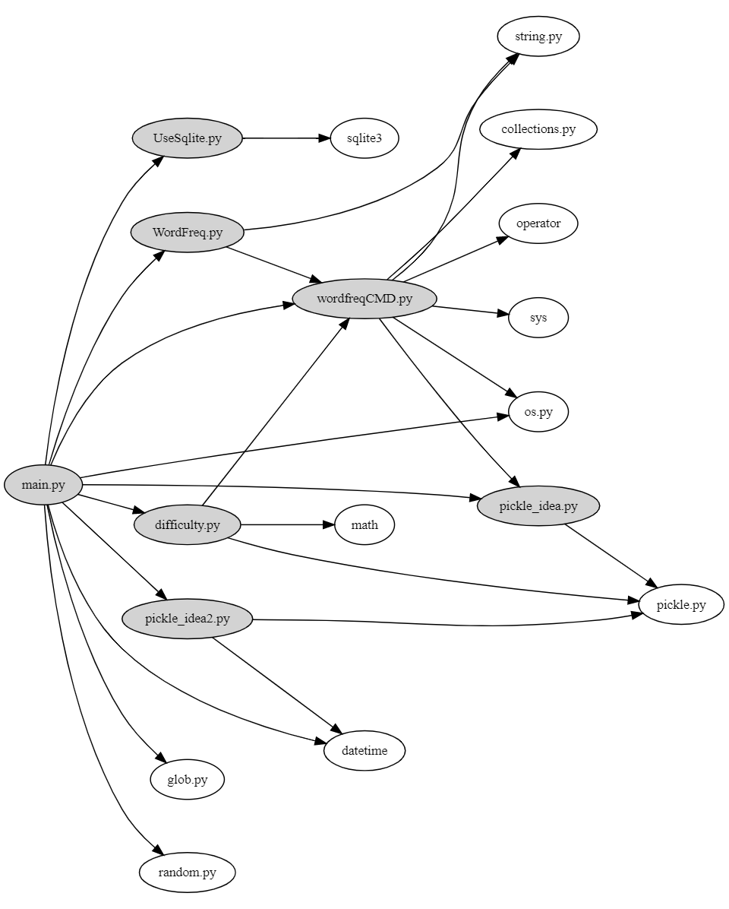

============================================================
**Lab1**--Dependency Analysis and Dependency Graph
============================================================

-----------------------------------------------------------

:小组成员信息:

* 毛顿 20183690024
* 欧洲 201836900207
* 杨晗涵 201836900210
* 刘威 201836900222
* 来锦韬 201836900220

:项目GitHub地址: `EnglishPal <https://github.com/AWel11/EnglishPal>`_

:项目Read The Docs地址: `Read The Docs <https://readthedocs.org/projects/englishpal/>`_

Abstract
========

借助相关开源软件对EnglishPal进行依赖分析。

Introduction
============
EnglishPal是一款致力于为用户提供方便快捷英语学习服务的网页应用。它提供了“单词本”的功能，可供用户查找添加单词，并根据用户的实际英语水平为其推荐合适难度的英语文章。

此次实验我们主要对EnglishPal的体系结构进行分析。一方面从模块构造的角度，探讨该软件文件间的依赖关系;另一方面从类/函数的角度，深入剖析文件内部类与函数的相互作用，理解软件的运行逻辑。

Materials and Methods
=====================

Materials
```````````````

* `Snakefood <https://github.com/blais/snakefood>`_ 一款轻量的Python代码依赖分析画图软件
* `Graphviz Online <https://dreampuf.github.io/GraphvizOnline/>`_ 基于 `Graphviz <https://graphviz.org/>`_ 的绘图网页
* `Mermaid Live Editor <https://mermaid-js.github.io/mermaid-live-editor/>`_ 在线多功能图形绘制网页

Methods
````````

* 借助开源软件，分析并绘制出模块依赖图。
* 阅读源码，手动绘制类与函数的依赖图并简单描述。
* 对软件进行调试运行，加深理解。

Results
=======

模块层（module-level）
``````````````````````````

*snakefood.dot*::

   # This file was generated by sfood-graph.
   
   strict digraph "dependencies" {
       graph [
           rankdir = "LR",
           overlap = "scale",
           size = "8,10",
           ratio = "fill",
           fontsize = "16",
           fontname = "Helvetica",
           clusterrank = "local"
           ]
   
          node [
              fontsize=12
              shape=ellipse
   //           style=filled
   //           shape=box
          ];
   
   //     node [
   //         fontsize=7
   //       style=ellipse
   //     ];
   
   "UseSqlite.py"  [style=filled];
   "UseSqlite.py" -> "sqlite3";
   "WordFreq.py"  [style=filled];
   "WordFreq.py" -> "wordfreqCMD.py";
   "WordFreq.py" -> "string.py";
   "difficulty.py"  [style=filled];
   "difficulty.py" -> "wordfreqCMD.py";
   "difficulty.py" -> "math";
   "difficulty.py" -> "pickle.py";
   "main.py"  [style=filled];
   "main.py" -> "UseSqlite.py";
   "main.py" -> "WordFreq.py";
   "main.py" -> "difficulty.py";
   "main.py" -> "pickle_idea.py";
   "main.py" -> "pickle_idea2.py";
   "main.py" -> "wordfreqCMD.py";
   "main.py" -> "datetime";
   "main.py" -> "glob.py";
   "main.py" -> "os.py";
   "main.py" -> "random.py";
   "pickle_idea.py"  [style=filled];
   "pickle_idea.py" -> "pickle.py";
   "pickle_idea2.py"  [style=filled];
   "pickle_idea2.py" -> "datetime";
   "pickle_idea2.py" -> "pickle.py";
   "wordfreqCMD.py"  [style=filled];
   "wordfreqCMD.py" -> "pickle_idea.py";
   "wordfreqCMD.py" -> "collections.py";
   "wordfreqCMD.py" -> "operator";
   "wordfreqCMD.py" -> "os.py";
   "wordfreqCMD.py" -> "string.py";
   "wordfreqCMD.py" -> "sys";
   
   
   }

依赖图（由Graphviz Online生成）



类/函数层（class-function-level）
`````````````````````````````````

*mermaid.txt*::

   classDiagram
       WordFreq ..> WordfreqCMD
       WordfreqCMD <.. Difficulty
       Sqlite3Template <|-- InsertQuery
       Sqlite3Template <|-- RecordQuery
       WordManipulation <.. GetTodayArticle
       GetTodayArticle ..|>Sqlite3Template
       Difficulty <|.. GetTodayArticle
       MainPage ..|> WordFreq
       WordManipulation <.. MarkWord
       PickleIdea <|.. WordManipulation
       MarkWord <-- MainPage
       UserMarkWord <-- UserPage
       UserReset <-- UserPage
       GetTodayArticle <.. UserPage
       UserPage ..|> PickleIdea2
       WordFreq <|.. UserPage
       WordManipulation <.. UserMarkWord
       Signup --|> UserManipulation
       Login  --|> UserManipulation
       Logout  --|> UserManipulation
       UserManipulation ..|>Sqlite3Template
       Sqlite3Template <|-- InsertQuery
       Sqlite3Template <|-- RecordQuery
       class PickleIdea{
          %%保存单词和词频
          +lst2dict(lst, d)
          +dict2lst(d)
          +merge_frequency(lst1, lst2)
          +load_record(pickle_fname)
          +save_frequency_to_pickle(d, pickle_fname)
       }
       class PickleIdea2{
          %%保存单词和日期
          +lst2dict(lst, d)
          +dict2lst(d)
          +merge_frequency(lst1, lst2)
          +load_record(pickle_fname)
          +save_frequency_to_pickle(d, pickle_fname)
       }
       
       class WordfreqCMD{
         %%处理文章字符串的工具类
         +freq(string)
         +youdao_link(string)
         +file2str(fname)
         +remove_punctuation(string)
         +sort_in_descending_order(List)
         +sort_in_ascending_order(List)
         +make_html_page (List,fname)
       }
       class WordFreq{
         %%初始化文章，获得词频
         %%依赖WordfreqCMD
         +init()
         +get_freq()
       }
       class Difficulty{
         %%计算文章、用户level，返回难度等级
         %%依赖WordfreqCMD
         +load_record(fname)
         +difficulty_level_from_frequency(word, d)
         +get_difficulty_level(d1, d2)
         +revert_dict(d)
         +user_difficulty_level(d_user, d)
         +text_difficulty_level(s, d)
       }
       class WordManipulation{
         +String path_prefix
         +load_freq_history(path)
         +get_time()
       }
       class GetTodayArticle{
         +dict dic
         +list article
         +within_range(x,y,r)
         +get_question_part(s)
         +get_answer_part(s)
       }
       class MainPage{
       %%依赖WordFreq
       %%拥有MarkWord
       +get_random_image()
       +get_random_ads()
       }
       class MarkWord{
       %%用于mainpage下标记单词
       }
       class UserPage{
       +date user_expiry_date
       +String username
       +String user_freq_record
       +appears_in_test(word,d)
       }
       class UserReset{
       %%没有匹配文章时，重定向到userpage
       }
       class UserMarkWord{
       %%用于userpage下标记单词
       }
       class UserManipulation{
       +String username
       +String password
       +bool available
       +bool verified
       +verify_user(username, password)
       }
       class Signup{
       +check_username_availability(username)
       +add_user(username, password)
       }
       class Login{
       +get_expiry_date(username)
       }
       class Logout{
       }
       class Sqlite3Template{
          %%连接数据库
          +__init__(self, db_fname)     
          +connect(self, db_fname)
          +instructions(self, query_statement)  
          +operate(self):
          +format_results(self)
          +do(self)
       }
       class InsertQuery{
         %%插入数据
         +instructions(self, query)
       }
       class RecordQuery{
         %%记录数据
         +instructions(self, query)
         +format_results(self)
         +get_results(self)
       }

依赖图（由Mermaid Live Editor生成）

.. image:: imgs/lab1/class-function-min.jpg

Discussions
===========

依赖分析
`````````````

**业务逻辑**

main.py中，我们将类别大致分为（1）单词操作类WordManipulation、（2）文章操作类GetTodayArticle、两个页面类（3）Mainpage和（4）Userpage以及（5）用户类UserManipulation.

在页面类中，MarkWord作为在Mainpage页面下标记单词，仅服务于Mainpage，二者是拥有者与被拥有者的关系;

同样，UserMarkWord作为在Userpage页面下标记单词和UserReset在用户没有匹配文章时重定向回Userpage，仅服务于Userpage，也是拥有者与被拥有者的关系。
Userpage中还需显示匹配的文章，要用到WordManipulation，因此Userpage依赖于WordManipulation，是使用者与被使用者的关系。

WordManipulation作为对单词的操作类，拥有load_freq_history、get_time等方法，用于加载词频、获取时间。
而MarkWord、UserMarkWord、GetTodayArticle三个类作为页面中对单词进行操作都依赖于WordManipulation，是使用者与被使用者的关系。

在用户类中，UserManipulation具有用户的基本信息：username、password等，以及验证用户名和密码是否通过，用户的操作如Signup、Login、Logout都作为子类继承UserManipulation，实现具体功能。

**文章推荐与单词统计**

新建一个WordfreqCMD类，做为一个工具类，提供处理字符串、列表的方法。

WordFreq类依赖于WordfreqCMD类，init初始化方法预处理文章，用WordfreqCMD的remove_punctuation方法删去字符串中的标点；get_freq依赖WordfreqCMD的sort_in_descending_order方法，返回一个降序后的词频列表。

Difficulty类用于计算一篇英文文章的难度等级，user_difficulty_level方法可以计算用户等级，其依赖于WordfreqCMD的sort_in_ascending_order方法；text_difficulty_level方法可以计算文章的难度等级，其依赖于WordfreqCMD的freq方法、sort_in_descending_order方法和remove_punctuation方法。

**信息查找、存储与更新**

sqlite3template 类用于连接数据库，其中有insertquery和recordquery两个子类，用于插入和记录数据。
pickle_idea和pickle_idea2两个类之间没有依赖关系，分别用于单词和词频的记录与单词和日期的记录。load_record方法加载pickle文件，save_frequency_to_pickle方法将数据保存到pickle文件中,merge_frequency方法用于合并两个list。

**整体依赖关系**

main.py中的单词操作类WordManipulation以PickleIdea作为接口，使用了其中的load_record函数获取单词记录，WordManipulation中的markword方法使用merge_frequency添加单词记录

MainPage类实现了WordFreq类，即WordFreq类是MainPage的接口，MainPage类中创建了一个WordFreq对象，使用该对象的get_freq函数获取单词记录频率。

Sqlite3Template类分别是UserManipulation类和GetTodayArticle类的接口：
UserManipulation类使用InsertQuery方法注册用户，使用RecordQuery方法验证用户名密码服务于用户登录SignUp，同时也是用这个方法检验用户注册是用户名是否重复。
GetTodayArticle类使用RecordQuery方法从数据库获取文章。

Difficulty类是GetTodayArticle类的接口，GetTodayArticle类使用get_difficulty_level方法获取当前单词频率情况的等级，使用text_difficulty_level方法获取文章等级，使用user_difficulty_level方法计算用户等级。

PickleIdea2类是UserPage类的的接口，UserPage类使用dict2lst获取历史单词频率，使用merge_frequency新增不认识的词汇，使用save_frequency_to_pickle将新增单词保存到pickle。

利弊分析
```````````

**界面操作**

#. 一些文字提示与其所对应的操作之间指示性不强，如主页中“试试”是注册用户操作，这既与上面的“成为会员”操作重复，且含义不明显，用户可能误解为登录操作等。

#. 注册账户与登录操作中密码无法可视化，用户难以确认是否有打字错误。

#. 登录有误（login中verified为false）时，页面只显示“无法通过验证”，无进一步登录提示，用户只能通过网页上的返回上一页面操作来重新登录。

#. 用户注册成功后，跳转的页面所含的功能有些重复且指向性不明确。如”你的用户名是XXX“，用户点击该用户名可跳转至用户页面，这与后面的”开始使用“功能一致，这里单纯显示用户名较好。且”开始使用“相对于”返回主页“也有些意味不明，改为”用户中心“等较好。

**代码逻辑**

#. mainpage中”粘贴一篇文章“中输入文章并点击”get文章中的词频“后,后台已对这篇文章中的词汇进行了统计与合并（即对frequency.p进行了修改）;但当用户在跳转的页面中对词汇进行勾选（即“mark”该单词）并点击“确认并返回”时，后台又对这些“marked”的词汇进行了统计，重复统计，意味不明。

**体系结构**

#. EnglishPal的模块化虽然纵向维度不深，但在横向维度上较好的将各个功能从主要的业务逻辑中抽离出来，在main.py中有条不紊的调用各分模块的功能，使得整体结构较为清晰。

#. 整体采用了经典的MVC网页应用体系结构，使得显示层、业务层与数据层彼此间相互较为独立，利于进一步的功能开发。

#. 在业务逻辑代码中嵌入了大量的网页显示代码，不仅使得分析代码与维护软件困难，更提高了更新应用的难度。

References
==========

暂时没有引用。
